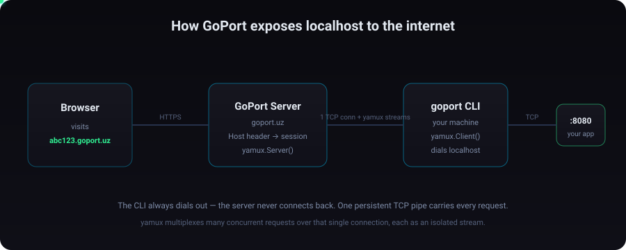

<div align="center">


**Expose localhost. Instantly.**

Make your local projects accessible from anywhere with a secure public URL — all with a single command.

[](LICENSE)
[](https://go.dev)
[](#contributing)

</div>

---

## What is GoPort?

GoPort is an open-source alternative to ngrok that turns local applications into publicly accessible HTTPS endpoints.

Whether you're testing webhooks, sharing a demo, or exposing an API, GoPort gives your localhost a public URL in seconds — without port forwarding, firewall changes, or a public IP.

### Components

| Component | Folder | Purpose |
|-----------|--------|---------|
| **CLI** (`goport`) | [`server/`](server) | Creates tunnels and forwards traffic from your machine. |
| **Backend** | [`backend/`](backend) | Routes incoming requests to the correct tunnel. |
| **Landing** | [`landing/`](landing) | Website and documentation. |

## How it works

<div align="center">



</div>

The flow, end to end:

1. **You run the CLI.** `goport http 8080` dials the GoPort server on TCP port `7000`. The CLI is always the one that initiates — the server never connects back to you, which is exactly why this works behind NAT and firewalls.
2. **Handshake.** Over that connection the CLI sends a small JSON message (`{ type, port, subdomain, reset }`). The server replies with your assigned `{ subdomain, url }`.
3. **Multiplexing kicks in.** Both sides wrap the same TCP connection with [yamux](https://github.com/hashicorp/yamux). The server side becomes `yamux.Server()`, the CLI side becomes `yamux.Client()`. yamux adds a small frame header (with a stream ID) to every chunk of data, so many requests can share one TCP pipe without their bytes ever mixing together.
4. **The server remembers you in memory.** It keeps a map of `subdomain → session`. The database is only touched once, during registration. All live routing is in-memory, so it stays fast.
5. **A browser hits your URL.** When a request arrives for `abc123.goport.uz`, the server reads the `Host` header, looks up your session, and calls `session.Open()` to create a fresh stream.
6. **The CLI answers.** That `Open()` unblocks an `Accept()` on the CLI side. The CLI dials your real local app (`127.0.0.1:8080`), forwards the HTTP request, reads the response, and copies it back through the stream.
7. **You disconnect.** When you press `Ctrl+C`, the connection closes and the server drops your session from its map. No stale tunnels left behind.

### Why TCP + yamux instead of a plain HTTP proxy?

A plain HTTP proxy opens a new connection per request and struggles with anything that isn't a simple request/response (WebSockets, streaming, keep-alive). By multiplexing over one long-lived TCP connection, GoPort handles concurrency cleanly, survives NAT, and supports upgrade-based protocols. The CLI even detects `Upgrade` requests (like WebSockets) and switches to a raw bidirectional copy so those work too.

One nice detail: GoPort preserves the original public `Host` header all the way to your local app. Tools like Swagger and OpenAPI build absolute URLs from that header, so keeping it intact means "Try it out" buttons and generated links keep working — the same way they do on ngrok.

---

## Installation

You need [Go 1.23+](https://go.dev/dl/) to build the CLI.

### Install the CLI

```bash
# Clone the repo
git clone https://github.com/muhammad-deve/GoPort.git
cd GoPort/server

# Build and install the goport binary onto your PATH
make install      # builds the dashboard + binary into $GOPATH/bin

# Or, if you just want the binary without rebuilding the web dashboard:
make install-go
```

After that, make sure `$GOPATH/bin` is on your `PATH`, then check it works:

```bash
goport --version
```

> **Windows note:** the Makefile builds `goport.exe`. If you don't have `make`, you can build directly with `go build -o goport.exe .` inside the `server/` folder.

### Point the CLI at a server

By default the CLI connects to the hosted server at `goport.uz`. To use your own self-hosted backend, set these environment variables before running:

```bash
export GOPORT_SERVER_ADDR="your-server.com:7000"   # where the CLI dials
export GOPORT_DOMAIN="your-server.com"             # used to build your public URL
```

---

## Usage

### Expose an HTTP port

```bash
goport http 8080
```

You'll get a live terminal dashboard like this:

```
$ goport http 8080

Dashboard        http://127.0.0.1:4040
Region           Europe (eu)
Status           online (12ms)
Forwarding       https://abc123.goport.uz → localhost:8080

HTTP Requests
-------------

15:04:21   GET     /api/users                          200 OK
15:04:23   POST    /api/login                          201 Created
```

Open `http://127.0.0.1:4040` in your browser for the full web dashboard — inspect every request and response, view headers and bodies, and **replay** any request with one click.

### Expose a raw TCP port

```bash
goport tcp 5432
```

### Commands and flags

```
goport http [port]    Expose a local HTTP port
goport tcp  [port]    Expose a local TCP port

Flags for `http`:
  -n, --name string     Request a custom subdomain (alias for --custom)
      --custom string   Request a custom subdomain
      --reset           Get a brand-new random subdomain
  -r, --region string   Region to use (default "eu")
```

### `--custom` — pick your own subdomain

By default GoPort reuses the last subdomain you were assigned, so your URL stays stable between runs. If you want a memorable, fixed address, claim one with `--custom` (or its shorthand `-n`):

```bash
goport http 8080 --custom myapp
# → https://myapp.goport.uz

goport http 8080 -n myapp        # same thing, shorter
```

Rules for custom subdomains:
- Lowercase letters, numbers, and `-` only, 1–63 characters.
- Can't start or end with `-`.
- A few names are reserved (`api`, `admin`, `back`, `dashboard`, `www`).
- If someone else already owns it, you'll get a clear "already taken" error.

### `--reset` — get a fresh random subdomain

Normally GoPort hands you back the same subdomain you used last time. When you want to deliberately throw that away and get a new random one — for example to invalidate an old link you shared — use `--reset`:

```bash
goport http 8080 --reset
# → https://x9k2qp.goport.uz   (a new random subdomain every time)
```

> `--reset` and `--custom` can't be used together — one asks for a random name, the other asks for a specific name, so combining them is rejected with an error.

---

## Self-hosting the server

The whole stack runs with Docker Compose. From the repo root:

```bash
cp .env.example .env     # fill in your values
docker compose up -d
```

This starts:
- **backend** — exposes the public API on `8095` and the tunnel listener on `7000`.
- **landing** — the marketing site on `3005`.

The backend listens for CLI connections on TCP `7000` (override with the `TCP_PORT` env var) and resolves public hostnames against `GOPORT_DOMAIN`. Put a reverse proxy (the included [`nginx/`](nginx) config is a good start) in front of it to terminate TLS for `*.your-domain.com`.

---

## Project layout

```
GoPort/
├── server/                 # the goport CLI (Go + Cobra)
│   ├── cmd/                # command definitions: root, http, tcp
│   │   ├── root.go         # rootCmd + Execute()
│   │   ├── http.go         # `goport http`, --custom / --reset / --region flags
│   │   └── tcp.go          # `goport tcp`
│   ├── tunnel/             # the tunnel engine
│   │   ├── tunnel.go       # dial, handshake, yamux client, request forwarding
│   │   ├── dashboard.go    # embedded web dashboard + JSON API
│   │   └── terminal_ui.go  # the live in-terminal request log
│   └── main.go
├── backend/                # public server (PocketBase + custom TCP service)
│   └── app/internal/service/tcp.go   # accepts CLI conns, assigns subdomains, routes traffic
├── landing/                # goport.uz site (Next.js)
├── nginx/                  # reverse proxy config
└── docker-compose.yml
```

---

## Tech stack

- **Go 1.23** — CLI and backend tunnel engine.
- **[Cobra](https://github.com/spf13/cobra)** — command-line interface.
- **[yamux](https://github.com/hashicorp/yamux)** — connection multiplexing.
- **[PocketBase](https://pocketbase.io)** — backend framework, auth, and subdomain registry.
- **Next.js** — landing page and the embedded CLI dashboard.

---

## Contributing

Contributions are welcome. To get started:

1. Fork the repo and create a branch: `git checkout -b feature/my-change`.
2. Make your changes. For the CLI, `cd server && make run` runs it against a local port.
3. Keep commits focused and write a clear message.
4. Open a pull request describing what changed and why.

If you're planning a larger change, open an issue first so we can talk through the approach.

---

## License

GoPort is released under the [MIT License](LICENSE).
