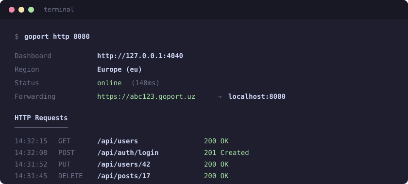

<div align="center">


**Expose localhost. Instantly.**

Make your local projects accessible from anywhere with a secure public URL — all with a single command.

[](LICENSE)
[](https://go.dev)
[](#contributing)

</div>

---

## What is GoPort?

GoPort is an open-source alternative to ngrok and jprq that turns local applications into publicly accessible HTTPS endpoints.

Whether you're testing webhooks, sharing a demo, or exposing an API, GoPort gives your localhost a public URL in seconds — without port forwarding, firewall changes, or a public IP.


## How it works

1. **Authenticate the CLI**

   ```bash
   goport auth <token>
   ```

   Authenticate the CLI with your GoPort account and connect it to your server.

2. **Start a tunnel**

   ```bash
   goport http 8080
   ```

   GoPort opens a secure outbound connection and instantly creates a public HTTPS URL for your local application.

3. **Use a custom subdomain**

   ```bash
   goport http 8080 --custom myapp
   ```

   Request a memorable URL for your tunnel:

   ```txt
   https://myapp.goport.uz
   ```

4. **Generate a new URL**

   ```bash
   goport http 8080 --reset
   ```

   Discards the current subdomain and creates a brand-new public URL.

5. **Monitor traffic in real time**

   After connecting, GoPort launches a local dashboard where you can inspect incoming requests, responses, tunnel status, and latency.

   <div align="center">
     
   </div>

6. **Route traffic to localhost**

   When someone visits your public URL, GoPort forwards the request through a secure tunnel directly to your local application.

7. **Disconnect cleanly**

   Press `Ctrl+C` at any time to close the tunnel. GoPort automatically removes the active session and releases the URL.

<div align="center">

</div>

## Installation

###  macOS

Install via Homebrew:

```bash
brew tap muhammad-deve/goport
brew install goport
```

###  Windows

Install via Chocolatey:

```bash
choco install goport
```

###  Linux

Install with the official installation script:

```bash
curl -fsSL https://goport.uz/install.sh | sh
```

### Verify Installation

```bash
goport --version
```

You should see the installed GoPort version printed to the terminal.
```

### Why TCP + yamux instead of a plain HTTP proxy?

A plain HTTP proxy opens a new connection per request and struggles with anything that isn't a simple request/response (WebSockets, streaming, keep-alive). By multiplexing over one long-lived TCP connection, GoPort handles concurrency cleanly, survives NAT, and supports upgrade-based protocols. The CLI even detects `Upgrade` requests (like WebSockets) and switches to a raw bidirectional copy so those work too.

One nice detail: GoPort preserves the original public `Host` header all the way to your local app. Tools like Swagger and OpenAPI build absolute URLs from that header, so keeping it intact means "Try it out" buttons and generated links keep working — the same way they do on ngrok.

---

---

## Technical Details

### Why TCP + yamux instead of a plain HTTP proxy?

GoPort uses a persistent TCP connection between the CLI and the server, with request multiplexing powered by yamux.

This approach allows multiple requests to share a single connection, reducing connection overhead and improving performance under load. It also works reliably behind NAT and firewalls because all traffic originates from the client.

Unlike simple reverse proxies, GoPort can efficiently handle many concurrent requests without repeatedly opening new connections.

One additional benefit is that GoPort preserves the original `Host` header when forwarding requests to your local application, making it compatible with frameworks and tools that rely on host-based routing.

## Tech Stack

* **Go 1.23** — CLI and tunnel engine
* **Cobra** — Command-line interface
* **yamux** — TCP stream multiplexing
* **PocketBase** — Authentication, tunnel management, and subdomain registry
* **Next.js** — Website and dashboard

## License

GoPort is released under the [MIT License](LICENSE).

